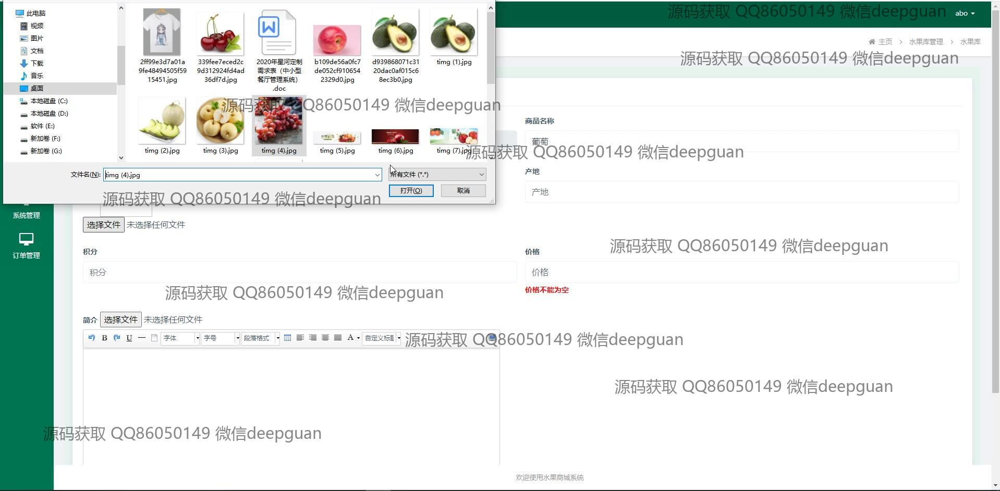
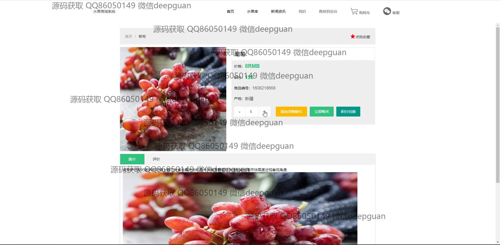
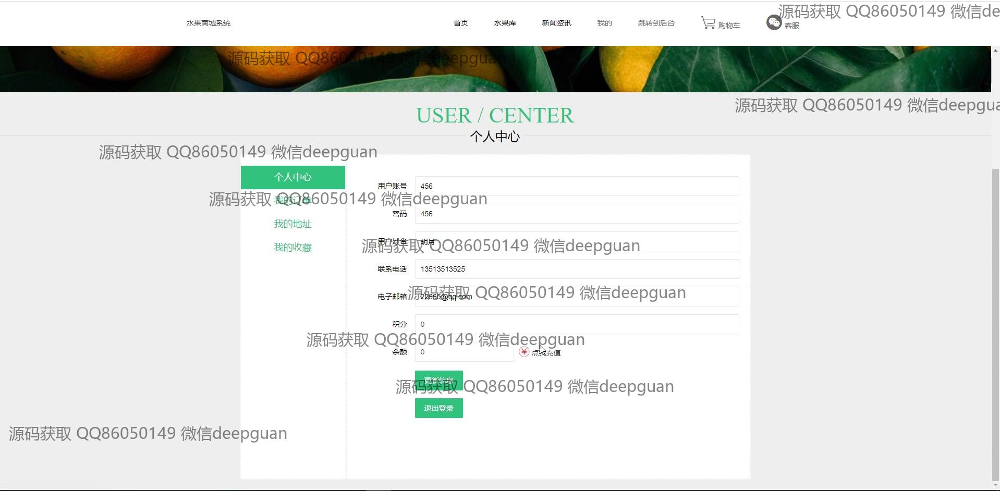
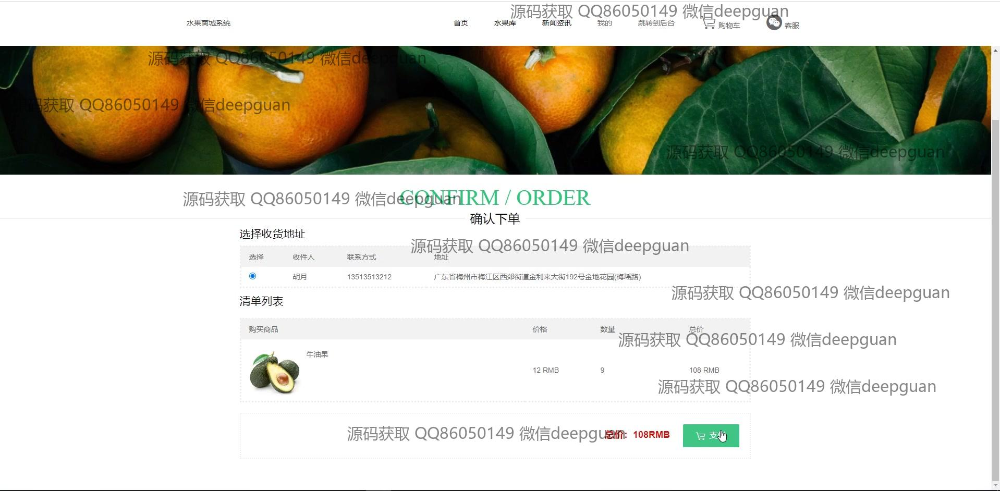

<h1 align="center">水果商城购物网站</h1>

## 简介
水果商城购物网站：角色分为管理员、用户；主要功能包括水果库管理、用户管理、订单管理、系统设置和购物等，实现简洁高效的在线购物和后台管理体验。    --计算机毕业设计源码；毕设源码；java毕业设计源码

## 联系方式

<h3 align="center">获取完整代码与数据库文件 + 微信：deepguan QQ: 86050149 QQ群: 783742310</h3>

<h3 align="center">可帮忙远程部署 包运行成功！提供远程部署、修改代码、设计文档指导、代码讲解等服务！</h3>

## 功能介绍（完整见运行截图）
管理员：后台管理功能包括登录、注册、退出，支持管理商品信息（添加、修改、删除），用户信息管理（账户、权限、联系方式等），订单管理（状态查看、退款操作等），系统配置（文件上传、库存设置），并提供直观的导航栏和数据展示模块，方便高效地完成系统运营与维护。

用户：基本功能包括登录、注册、退出，支持在网站首页通过导航栏访问水果库、新闻资讯、购物车、个人中心等模块，查看水果详情页，筛选商品并添加至购物车，完成结算与在线支付。个人中心功能允许用户管理账户信息、查看积分余额及充值，查询订单、收藏商品，并编辑收货地址。

购物页面：提供水果详情页展示，包括商品图片、名称、价格、编号、产地等信息，支持选择购买数量、积分兑换功能，并通过按钮实现添加购物车或直接购买操作。订单确认页可查看订单清单、选择收货地址，并通过支付按钮完成购买，界面简洁明了，优化用户购物体验。

订单管理：用户可在订单管理页面查看订单状态（未支付、已支付、已发货、已完成、已退款等），查看订单详情（商品信息、数量、总价、地址等），并支持相应的订单操作，如退款或删除。管理员则通过后台订单管理功能处理订单，确保商城运行流畅。

## 运行截图

本代码来源于网络,仅供学习参考使用!

